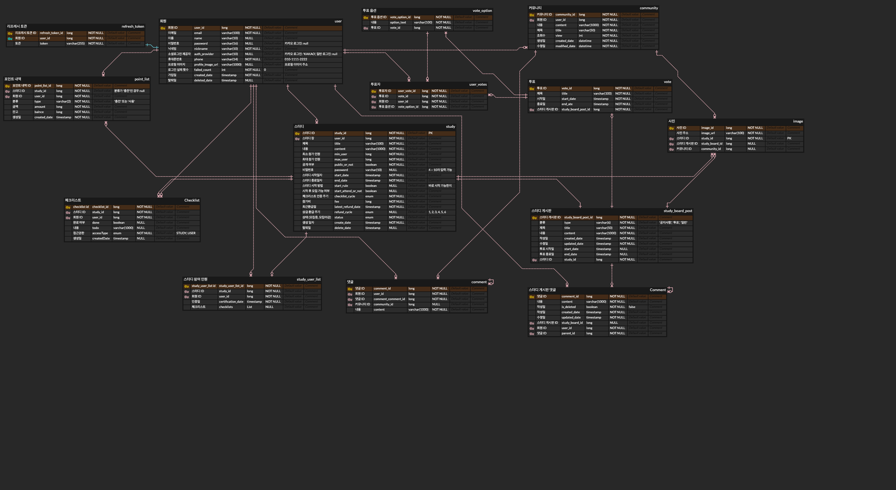
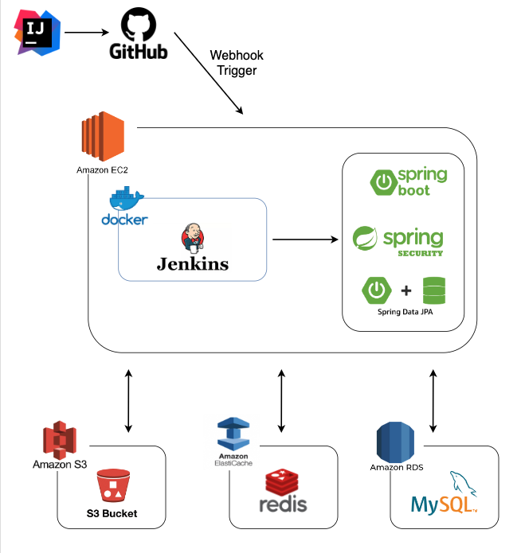

# 문방구 프로젝트

## 서비스 설명

**문방구**는 이용자들이 보다 효과적으로 학습할 수 있도록 지원하는 서비스입니다. 이 서비스는 스터디 그룹 참여, 체크리스트 공유 및 인증 확인 기능을 제공하여 사용자가 공부에 대한 동기를 높일 수 있도록 돕습니다. 같은 목표를 가진 스터디원들과 함께 학습함으로써, 공부 효율을 극대화할 수 있습니다.

## 주요 기능

**회원 관리**

- 회원가입: 일반 회원가입 및 소셜 로그인 옵션 제공.
    - 일반 회원가입: 이메일, 비밀번호, 닉네임, 휴대폰 번호 필요.
    - 소셜 로그인: 이메일, 닉네임 필요.
    - 비밀번호 및 휴대폰 번호 암호화 저장.
    - 이메일 인증 필요 (5분 내 인증번호 입력).
    - 닉네임 중복 확인 (2~10자, 한글/영문/숫자 사용).
- 로그인: 일반 로그인 및 소셜 로그인 지원.
- 비밀번호 관리: 비밀번호 5회 틀릴 시 계정 잠금, 잠긴 계정은 비밀번호 변경으로 해제.
- 회원정보 조회 및 수정: 이메일, 닉네임, 휴대폰 번호, 프로필 사진, 스터디 참여 이력 조회 및 수정 가능.
    - 아이디, 비밀번호 찾기: 아이디와 비밀번호 찾기 위해 핸드폰 인증 필요

**스터디 관리**

- 스터디 생성: 스터디명, 소개, 참여 인원, 공개 여부, 시작/종료 일자, 참가비 등 설정.
- 스터디 참여: 공개 스터디는 자유롭게, 비공개 스터디는 비밀번호 필요.
- 스터디 운영: 게시판, 자료실 운영, 체크리스트 관리, 상금 환급.
    - 스터디 상태 관리: 모집중/모집마감, 진행중/종료스터디 상태 관리.
    - 참여도 관리: 체크리스트 인증을 통한 참여도 측정 및 갱신.
    - 소통 공간 제공: 공지사항, 투표, 일반 게시글 작성 가능한 스터디 전용 게시판 구성.

**커뮤니티**

- 카테고리: 일상, 질문.
- 게시물 작성: 회원은 여러 게시물을 작성할 수 있음.
    - 게시글 요구사항: 제목과 내용 필수, 사진 첨부 선택적.
    - 댓글 및 대댓글: 게시글에 댓글과 대댓글 작성 가능.
    - 내용 관리: 본인이 작성한 게시글, 댓글, 대댓글의 수정 및 삭제 지원.
- 해시태그 검색: 게시글 내 해시태그를 통한 검색 지원.

**보안 및 인증**

- 휴대폰 번호 인증: SMS를 통한 인증.
- 토큰 기반 인증: Access Token (48시간 유효), Refresh Token (한 달 유효).

**결제 및 포인트 시스템** (구현중)

- 포인트 충전: 카카오 페이를 통한 충전.
- 참가비 및 상금 관리: 스터디 참가비 지불 및 환급.

## ERD

## 시스템 아키텍처

## 기술 스택

- Java11
- springboot 2.
- Redis
- H2 Database
- MySQL
- AWS S3

### 외부 API

- coolSMS
- JavaMailSender
- import
- 카카오 로그인
